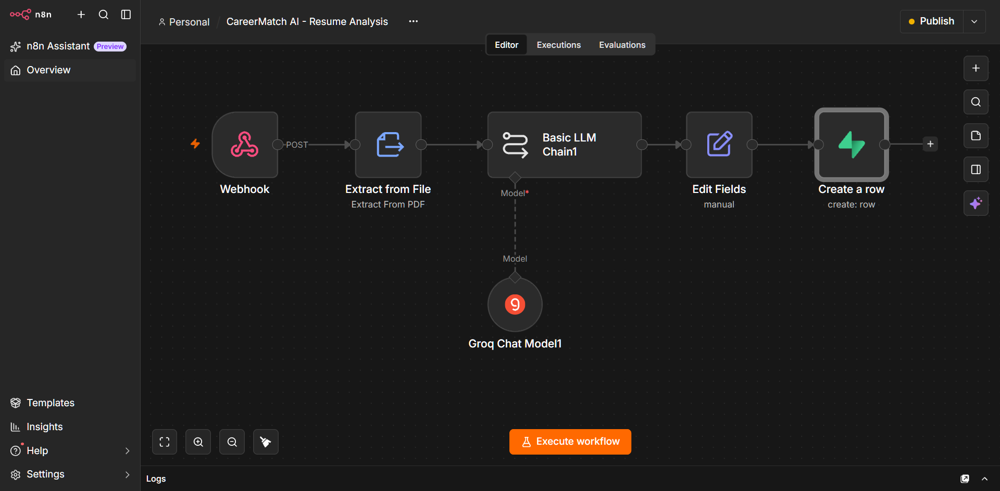
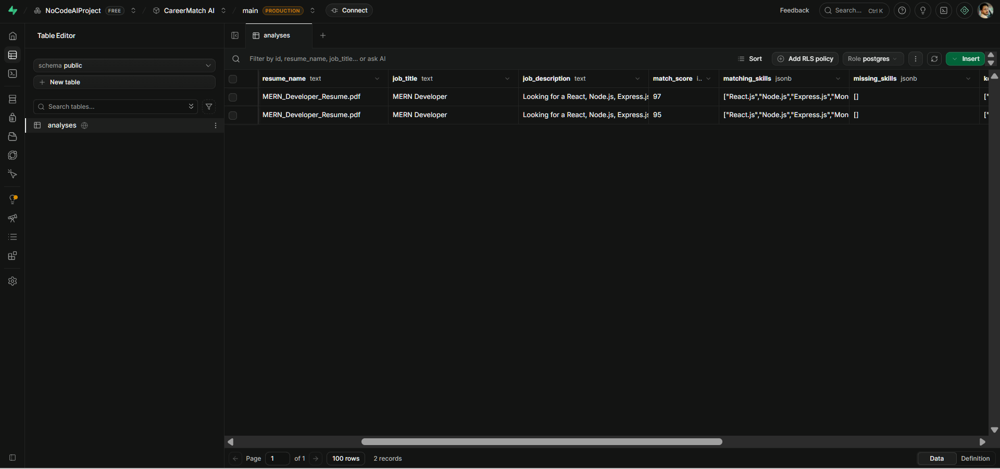
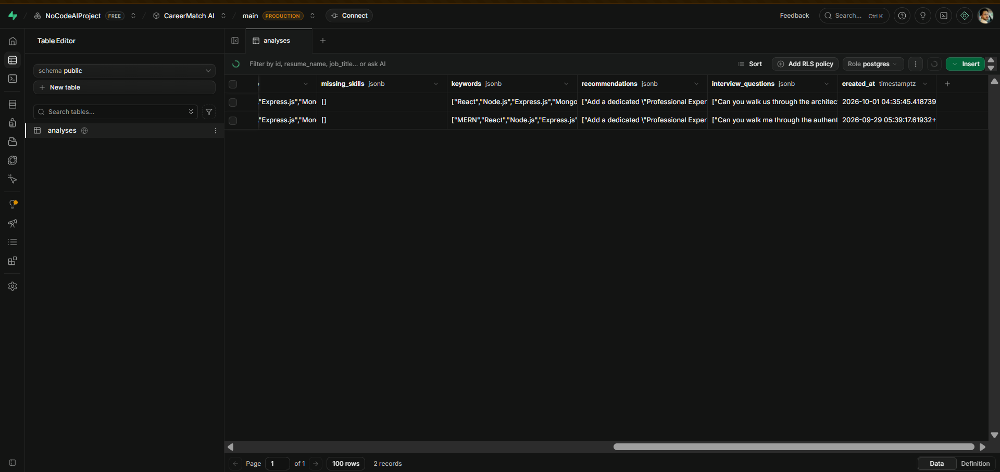

# CareerMatch AI — AI Resume Analyzer & Job Matcher

CareerMatch AI is a no-code/low-code AI-powered resume analysis and job matching platform built with **n8n, Groq, and Supabase**.

It analyzes a candidate's resume against a given job description and generates a structured assessment of skills, ATS keywords, experience, qualifications, resume structure, and interview preparation.

## 🚀 Features

* 📄 PDF resume upload and text extraction
* 💼 Job title and job description analysis
* 🤖 AI-powered resume-to-job matching
* ✅ Matching skills identification
* ❌ Missing skills identification
* 🔑 ATS keyword extraction
* 📊 Overall job match score
* 📈 Individual scoring for:

  * Skills Match
  * ATS Keywords Match
  * Experience Match
  * Qualification Match
  * Resume Structure
* 💡 Personalized recommendations
* 🎯 Exactly 5 AI-generated interview questions
* 💾 Analysis results stored in Supabase
* 🔄 Automated workflow using n8n

## 🛠️ Tech Stack

* **Workflow Automation:** n8n
* **AI Model:** Groq — `openai/gpt-oss-120b`
* **Database:** Supabase
* **File Processing:** n8n Extract from File
* **API:** Webhook
* **Deployment:** Self-hosted n8n
* **Version Control:** Git & GitHub

## 🏗️ Workflow Architecture

```text
Resume PDF + Job Details
          ↓
       Webhook
          ↓
   Extract PDF Text
          ↓
     AI Analysis
     (Groq + LLM)
          ↓
   Score Calculation
          ↓
    Supabase Database
```

### Workflow Screenshot



## 🧠 AI Analysis

The AI evaluates the resume against the provided job description and generates:

* Matching skills
* Missing skills
* ATS keywords
* Experience comparison
* Qualification comparison
* Resume improvement recommendations
* Interview questions
* Component match percentages

The system is instructed to base its analysis only on information present in the resume and job description rather than inventing candidate skills or experience.

### Analysis Results

#### Match Overview



#### Detailed AI Analysis



## 📊 Match Score

The overall match score is calculated using weighted components:

| Component           | Weight |
| ------------------- | -----: |
| Skills Match        |    40% |
| ATS Keywords Match  |    25% |
| Experience Match    |    15% |
| Qualification Match |    10% |
| Resume Structure    |    10% |

```text
Overall Score =
(Skills × 0.40)
+ (Keywords × 0.25)
+ (Experience × 0.15)
+ (Qualification × 0.10)
+ (Resume Structure × 0.10)
```

The score is a project-defined matching metric and should not be treated as an authoritative hiring or ATS decision.

## 🗄️ Database

Analysis results are stored in a Supabase `analyses` table containing information such as:

* Resume name
* Job title
* Job description
* Extracted resume text
* Overall match score
* Matching skills
* Missing skills
* ATS keywords
* Recommendations
* Interview questions
* Analysis timestamp

## 🔐 Security

Credentials and sensitive configuration are **not included in this repository**.

Environment variables, API credentials, database secrets, and private configuration should be stored securely in the n8n credential system or environment configuration.

## ⚙️ Local Setup

### 1. Clone the repository

```bash
git clone https://github.com/ankitmangaraj/career-match-ai.git
cd career-match-ai
```

### 2. Install and run n8n

Run n8n using Docker or another self-hosted installation.

### 3. Import the workflow

Import:

```text
n8n/career-match-ai-workflow.json
```

into your n8n instance.

### 4. Configure credentials

Configure the required credentials for:

* Groq
* Supabase

### 5. Configure the Supabase database

Create an `analyses` table with the fields required by the workflow.

### 6. Configure the webhook

The workflow accepts:

* Resume PDF
* Job title
* Job description

The webhook endpoint is:

```text
POST /webhook/analyze-resume
```

## 📁 Project Structure

```text
career-match-ai/
│
├── n8n/
│   └── career-match-ai-workflow.json
│
├── screenshots/
│   ├── workflow.png
│   ├── analysis-result-1.png
│   └── analysis-result-2.png
│
├── .gitignore
└── README.md
```

## 🔄 Example Workflow

A typical request contains:

```text
Resume: MERN Developer Resume.pdf

Job Title:
MERN Developer

Job Description:
Looking for a React, Node.js, Express.js and MongoDB developer.
```

The workflow extracts the resume text, sends the resume and job description to the AI model, calculates the defined match score, and stores the resulting analysis in Supabase.

## 🎯 Project Purpose

This project demonstrates practical experience with:

* AI workflow automation
* LLM integration
* Resume parsing
* Prompt engineering
* Structured AI output
* REST/webhook-based workflows
* Database integration
* JSON data processing
* Git/GitHub
* No-code/low-code application architecture

## 🔮 Future Improvements

* Interactive frontend for candidates
* Resume upload interface
* Job description input form
* Visual match-score dashboard
* Resume improvement suggestions
* Job recommendation system
* Multiple resume comparison
* Authentication and user accounts
* Resume history and analytics
* Automated email reports

## ⚠️ Limitations

The generated match score is based on the project's predefined scoring methodology. It is not an official ATS score and should not be used as the sole basis for hiring decisions.

AI-generated recommendations and interview questions should also be reviewed by the user.

## 👨‍💻 Author

**Ankit Mangaraj**

* GitHub: [ankitmangaraj](https://github.com/ankitmangaraj)
* LinkedIn: [Ankit Mangaraj](https://www.linkedin.com/in/ankitmangaraj/)
